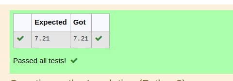

# DISTANCE-BETWEEN-TWO-POINTS

## AIM:
To write a python program to find the distance two 2 points
## ALGORITHM:
### Step 1: 
import math
### Step 2: 
assign the cordinates points to a variable
### Step 3: 
Substitute the values in the distance formula  
### Step 4:
print the value
### Step 5: 
End the program

### PROGRAM:
 ```
 #Program to find distance between two points.
#Developed by : SABARI S
#Register no: 22008698
 
 import math as m
l1=[4,2]
l2=[10,6]
d=m.sqrt((l2[0]-l1[0])**2+(l2[1]-l1[1])**2)
print("{:.2f}".format(d))
```


### OUTPUT:


### RESULT:
The program is executed sucessfully.
